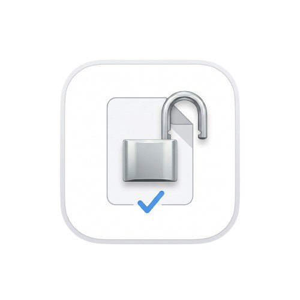
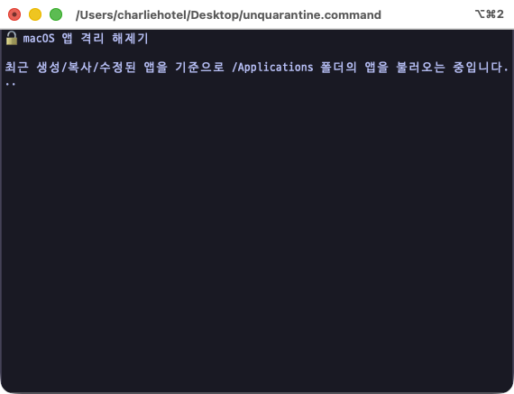
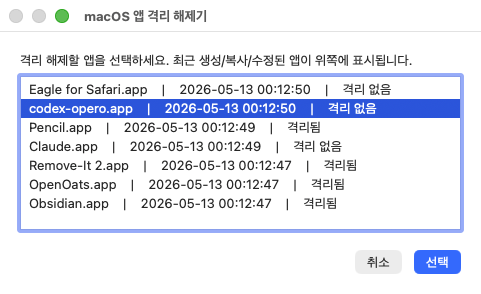
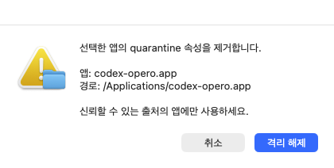
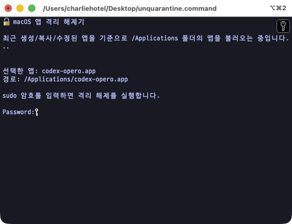
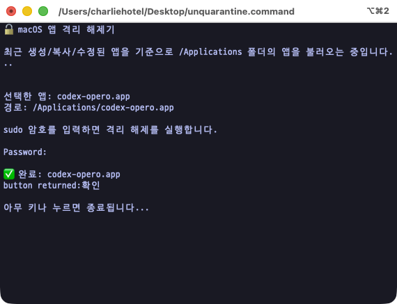

# macOS 앱 격리 해제기

<p align="center">
  
</p>

신뢰할 수 있는 출처에서 받은 macOS 앱의 `com.apple.quarantine` 속성을 쉽게 제거하는 작은 도구입니다.

macOS는 인터넷에서 다운로드한 앱에 quarantine 속성을 붙이고, 첫 실행 때 Gatekeeper 검사를 수행합니다. 이 도구는 `/Applications` 폴더에 있는 앱 목록을 보여준 뒤, 사용자가 선택한 앱 하나의 quarantine 속성만 제거합니다.

> **주의:** 이 도구는 보안 기능을 우회하는 데 사용할 수 있습니다. 출처를 신뢰할 수 있고, 직접 실행해도 된다고 판단한 앱에만 사용하세요.

## 누구를 위한 도구인가요?

- GitHub에서 오픈소스 macOS 앱을 받아 사용하는 사용자
- 직접 빌드하거나 다운로드한 `.app`을 `/Applications`에 넣어 쓰는 사용자
- 매번 터미널에서 `xattr -rd com.apple.quarantine ...`를 입력하기 번거로운 사용자

완전한 일반 소비자용 notarized 앱은 아닙니다. 이 도구 자체도 GitHub에서 받으면 macOS가 첫 실행을 막을 수 있습니다.

## 다운로드와 실행

### 방법 1. `.command` 스크립트로 사용하기

이 저장소를 clone하거나 `unquarantine.command` 파일을 다운로드합니다.

```sh
git clone https://github.com/<your-name>/unquarantine.git
cd unquarantine
./unquarantine.command
```

Finder에서 `unquarantine.command`를 더블클릭해서 실행할 수도 있습니다.

다운로드한 파일이 실행되지 않으면 터미널에서 실행 권한을 부여하세요.

```sh
chmod +x unquarantine.command
```

### 방법 2. 앱 패키지로 사용하기

향후 Release에는 `.dmg` 형태의 앱 패키지도 함께 제공할 수 있습니다.

다만 Apple Developer ID로 서명/공증된 앱이 아니라면, `.app`이나 `.dmg`로 제공하더라도 최초 실행 시 macOS가 실행을 막을 수 있습니다. 그 경우 한 번만 직접 허용한 뒤 사용할 수 있습니다.

## 사용 흐름

### 1. 앱 목록 불러오기

실행하면 `/Applications` 폴더의 앱을 최근 생성/복사/수정된 순서로 불러옵니다.

<table>
  <tr>
    <td></td>
  </tr>
</table>

---

### 2. 격리 해제할 앱 선택

목록에는 앱 이름, 최근 변경 시각, 격리 상태가 표시됩니다.

<table>
  <tr>
    <td></td>
  </tr>
</table>

최신 버전에서는 안전한 경로 매핑을 위해 앱 이름 앞에 `[번호]`가 함께 표시될 수 있습니다.

`격리됨`으로 표시된 앱만 실제 해제 대상입니다. `격리 없음` 앱을 선택하면 관리자 권한 작업을 실행하지 않고 중단합니다.

---

### 3. 실행 전 확인

선택한 앱 이름과 경로를 다시 보여줍니다. 신뢰할 수 있는 앱인지 확인한 뒤 `격리 해제`를 누르세요.

<table>
  <tr>
    <td></td>
  </tr>
</table>

---

### 4. 관리자 암호 입력

quarantine 속성 제거에는 관리자 권한이 필요할 수 있습니다. 터미널에서 macOS 사용자 암호를 입력합니다.

<table>
  <tr>
    <td></td>
  </tr>
</table>

암호를 입력할 때 화면에는 글자가 표시되지 않는 것이 정상입니다.

---

### 5. 완료

작업이 성공하면 완료 대화상자가 표시됩니다.

<table>
  <tr>
    <td></td>
  </tr>
</table>

터미널에서도 완료 메시지를 확인할 수 있습니다.

<table>
  <tr>
    <td></td>
  </tr>
</table>

---

## 이 도구가 하는 일

선택한 앱에 대해 아래 명령을 실행합니다.

```sh
sudo xattr -rd com.apple.quarantine "/Applications/선택한앱.app"
```

정확히는 다음과 같이 동작합니다.

- `/Applications` 바로 아래의 `.app` 번들만 표시합니다.
- 앱 목록은 최근 생성일, 수정일, 메타데이터 변경일 중 가장 최신 값을 기준으로 정렬합니다.
- 선택한 앱에 quarantine 속성이 실제로 있는지 다시 확인합니다.
- 확인 후 선택한 앱 번들 안의 quarantine 속성을 재귀적으로 제거합니다.
- 다른 확장 속성은 제거하지 않습니다.

## 직접 명령어로 하고 싶다면

터미널에 익숙하다면 이 도구 없이 직접 실행할 수도 있습니다.

```sh
sudo xattr -rd com.apple.quarantine "/Applications/AppName.app"
```

격리 속성이 있는지 확인하려면:

```sh
xattr -lr "/Applications/AppName.app" | grep com.apple.quarantine
```

## 첫 실행이 막힐 때

GitHub에서 받은 `.command` 또는 `.app` 자체에도 quarantine 속성이 붙을 수 있습니다. 이 경우 macOS가 “확인되지 않은 개발자” 경고를 표시할 수 있습니다.

가능한 해결 방법:

1. Finder에서 파일을 Control-클릭합니다.
2. `열기`를 선택합니다.
3. 경고창에서 다시 `열기`를 선택합니다.

또는 터미널에서 이 도구 자체의 quarantine 속성을 제거할 수 있습니다.

```sh
xattr -d com.apple.quarantine ./unquarantine.command
```

`.app` 패키지라면:

```sh
xattr -rd com.apple.quarantine "/Applications/Unquarantine.app"
```

## 보안상 주의사항

- 모르는 출처의 앱에는 사용하지 마세요.
- 악성 앱도 quarantine 속성을 제거하면 macOS의 첫 실행 경고 없이 실행될 수 있습니다.
- 이 도구는 Gatekeeper를 끄지 않습니다.
- 시스템 전체 설정을 변경하지 않습니다.
- 사용자가 선택한 앱 하나의 `com.apple.quarantine` 속성만 제거합니다.

## 현재 상태

현재 저장소에는 `.command` 스크립트와 사용 흐름 스크린샷이 포함되어 있습니다.

## 라이선스

MIT License로 배포합니다.
